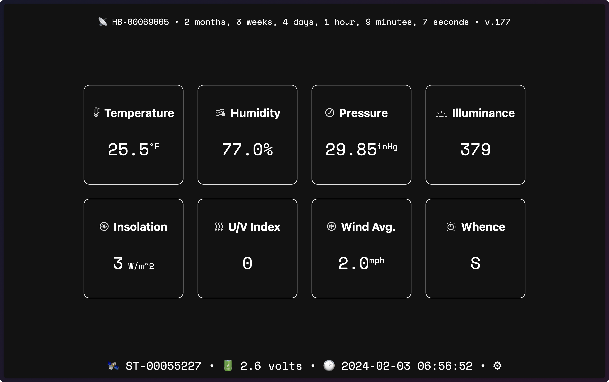
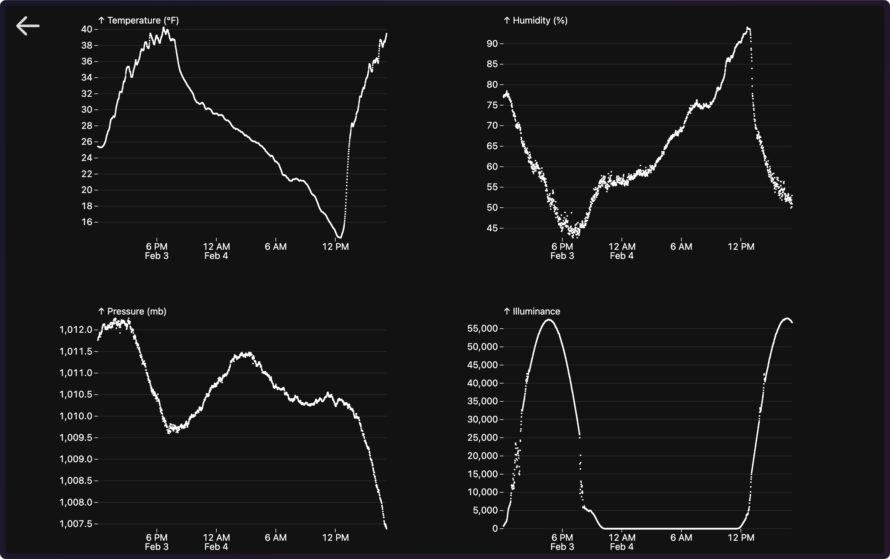
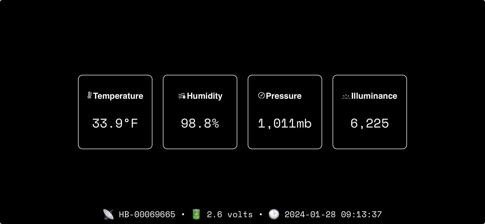
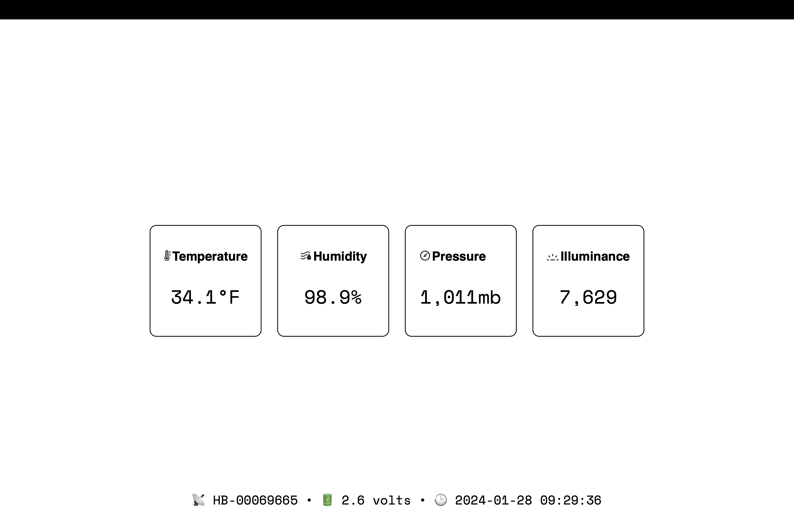

# williwaw: Weatherflow Tempest Self-Contained Console & Datalogger


 

## Overview

This project builds a WIP self-contained Golang binary that presents
current readings from a Weatherflow Tempest weather station to a web
client. It is designed to be used as a full-screen display on a
wall-mounted tablet or monitor.

## TODO

- [ ] Handle other Tempest UDP events
  - [x] `hub_status`
- [x] Preferences form/route
- [x] Handle most UI value formatting in HTML/JS
- [x] SQLite data logger option
- [x] Charts
  - [x] Have them use units prefs
  - [ ] Auto refresh
- [x] Data export API

## Build

``` bash
$ # clone me
$ cd williwaw
$ go build .
```

## Run

On interrupt/control-c, the program cleans up after itself, but you can
also terminate it remotely via the `/quit?token=something-you-make-up`
endpoint:

``` bash
$   SEEKRIT_TOKEN=bye DB_PATH=readings.db ./williwaw
```

If you don’t set `SEEKRIT_TOKEN` the `/quit` route will not be set up.

If you don’t set `DB_PATH` the datalogger won’t be started.

You can use CLI params or environent variables or a `.env` files to set
preferences:

``` bash
$ Usage: williwaw [--seekrit SEEKRIT_TOKEN] [--path DB_PATH] [--listen-port PORT]

Options:
  --seekrit SEEKRIT_TOKEN, -s SEEKRIT_TOKEN
                         token enabling remote disabling [env: SEEKRIT_TOKEN]
  --path DB_PATH, -p DB_PATH
                         Full path to datalogger file db [env: DB_PATH]
  --listen-port PORT, -l PORT
                         port to listen on [default: 9867, env: PORT]
  --help, -h             display this help and exit
```

## Routes

- `/` - the main page where readings are updated
- `prefs` - interact with user preferences
- `/quit?token=something-you-make-up` - terminates the program; REQUIRES
  `SEEKRIT_TOKEN` to be set
- `/charts` - charts page; REQUIRES `DB_PATH` to be set
- `/since?ts=yyyy-mm-dd` - returns all readings since the given
  timestamp (including the given timestamp) as a JSON array; REQUIRES
  `DB_PATH` to be set

## Tailscale

Highly suggest running this on a Tailscale tailnet for ubiquitous access
w/o exposing anything to the internet directly. If that’s possible,
here’s a sample nginx reverse proxy config:

``` nginx
location /tempestwx/ {
  proxy_pass http://#.#.#.#:#/;
  proxy_set_header Host $host;
  proxy_set_header X-Real-IP $remote_addr;
  proxy_set_header X-Forwarded-for $remote_addr;
  proxy_ssl_verify off;
  port_in_redirect off;
  proxy_connect_timeout 300;
  proxy_http_version 1.1;
  proxy_set_header Upgrade $http_upgrade;
  proxy_set_header Connection "upgrade";
}
```

## WAT

Around five years go I got a few NuVision TMAX cheap 8” Windows tablets
(~\$50.00 USD). They’re dinky (2GB RAM, 32GB slow SSD, Windows Home 10),
but they can be used as a kiosk-mode display.

I’ve put off front-ending my Weatherflow Tempest HTML display project
for this for way too long and decided to give it a go after re-finding a
tablet whilst poking for something else.

After an arduous “it’s been five years since your last Windows update”
process, and getting Golang on the thing, this works pretty well.

It uses:

- [fir](https://github.com/livefir/fir/) which is a Go toolkit to build
  reactive web interfaces that uses
  [html/template](https://pkg.go.dev/html/template) and
  [alpinejs](https://alpinejs.dev/) under the hood
- code from my
  [go-weatherflow](https://github.com/hrbrmstr/go-weatherflow) for the
  UDP dance to listen for the local broadcasts.

{fir} is pretty neat! It uses websockets for comms and only updates the
portions of the web page that have data changes.

## Screenshots

Arc (dark mode) is shown up top. I’ll take new captures of these (below)
eventually.

**Windows** (tablet/Chrome)


**iOS**



**Safari** (light mode)



## REF

- [WeatherFlow Tempest UDP Reference -
  v171](https://weatherflow.github.io/Tempest/api/udp/v171/)
